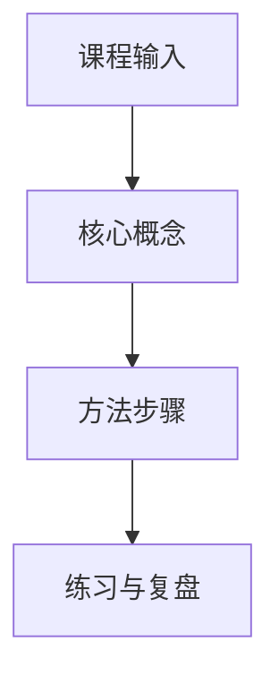

# {{course}} 关键图表与课件索引

> 目标：让课程不再只有纯文字。此页只索引真实截图、附件、课件页或手动画图，不编造图片。

## 1. 关键图像 / 截图

| 图像 | 来源 | 说明 | 状态 |
|---|---|---|---|
| `![[待补充.png|160]]` | 待补充 | 待补充 | 待核验 |

## 2. 流程图

## 3. 对照表

| 模块 | 关键问题 | 证据/来源 | 输出物 |
|---|---|---|---|
|  |  |  |  |

## 4. 待补视觉材料

- [ ] 课程截图
- [ ] 概念关系图
- [ ] 流程图
- [ ] 作品/案例对比
